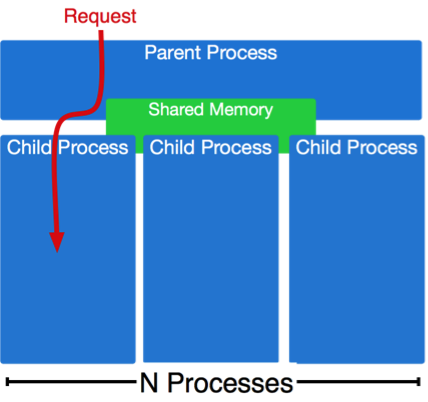
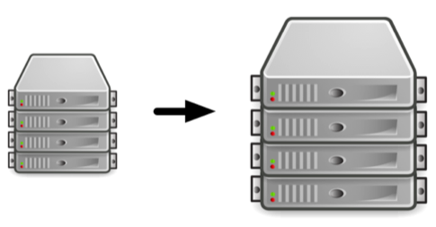
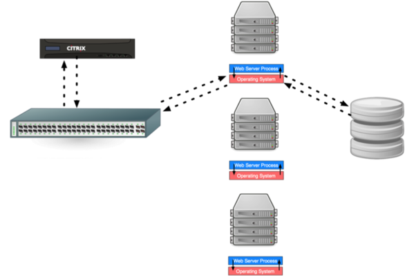
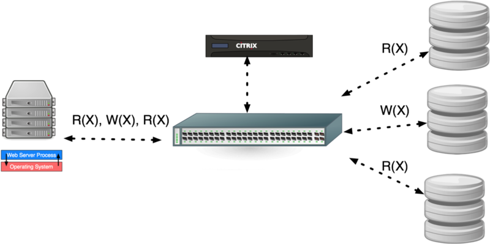

# Motivation

You have your web application running on EC2. It is becoming increasingly popular and performance is degrading. *What do you do?*

## Handling Concurrent Requests

You have deployed application servers that can serve many concurrent requests. But as your site's popularity continues to grow that is not sufficient.

## Vertical Scaling

You have increased your instance sizes and handled more load. However, as the popularity continues to grow you are no longer able to continue scaling vertically.

## Horizontal Scaling

You have introduced a load balancer that distributes traffic across a pool of application servers. Nevertheless, as the traffic continues to increase, additional horizontal scaling of the application servers does not solve the problem.

## Caching

You have properly configured HTTP caching such that unnecessary requests never happen. You are also caching heavyweight database operations. But it is still not enough to handle the increased load of your popular site.

## SQL Structure and Query Optimization

You have reduced the number of queries your application servers makes to the database. You have used `EXPLAIN` to discover indexes to add, and to ensure your most common SQL queries are as optimal as possible. However, your database is still a bottleneck.

## Non-trivial DB Horizontal Scaling

> Can we horizontally scale the database by adding more database servers and accessing them through a load balancer?

Unfortunately, it's not that simple. Horizontal scaling works great for `stateless` services. However, the database contains the state of our application, thus is not trivial to horizontally scale.

Note: Horizontally scaling databases in this way works fine for read-only operations.

## Scaling Relational Databases

- [ ] Sharding
- [ ] Service Oriented Architectures (SOA)
- [ ] Separating Reads from Writes

# Partitioning (Sharding)

Take a single database and ***split/partition/shard*** it up into multiple smaller databases such that everything still works.

> How do we handle joins across partitioned data?

## Joins

Any particular database join connects a small part of your database. However, transitively, database joins could connect everything together.

> **E.g. Demo App:** 
>
> - Any comment is only related to its parent (if not top-level), its children (replies), and its submission.
> - Submissions relate to each other through communities.
> - Transitively, all of these relationships could be joined across.
